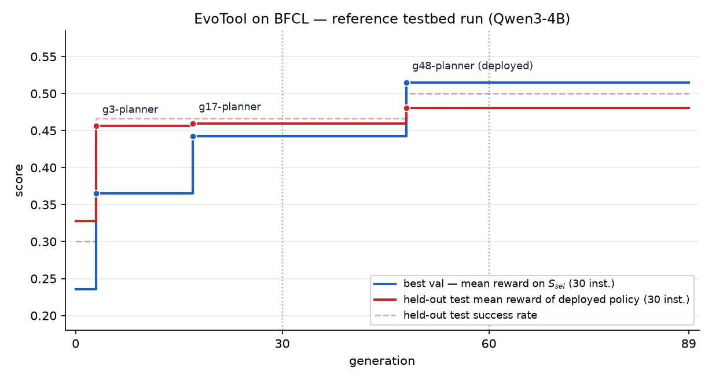

# Case study: how EvoTool evolved a planner on BFCL

> **Provenance.** Reference **testbed** run: Qwen3-4B backbone, 150-instance curated BFCL demo subset (90 train / 30 sel / 30 test, seed 42), 3 epochs = 90 generations — *not* the paper's evaluation (the paper uses Qwen3-8B on the full benchmarks).
> All quotes below are verbatim excerpts from this run's structured run log (diff blocks re-wrapped for readability; added text unchanged); browse every one of the 90 generations interactively in [docs/replay.html](docs/replay.html) ([live version](https://syang2000.github.io/ACL_2026_EvoTool/replay.html) once GitHub Pages is enabled).

This walkthrough follows the mutation chain that produced the **deployed policy** `g48-planner` — the Θ\* shipped in [`evolved_policies/bfcl/theta_star.json`](evolved_policies/bfcl/theta_star.json):

```
init  →  g3-planner  →  g11-planner  →  g17-planner  →  g48-planner   (deployed)
```

Each generation, the loop rolls out the parent policy on a 3-instance training mini-batch, the **Blamer** localizes the failure to one module from the trajectory, the **Mutator** edits only that module's prompt spec, and the child is kept if it helps. In this run the Blamer proposed 90 mutations (planner 29, caller 53, selector 4, synthesizer 4) and 27 were accepted — notably, planner edits were the durable ones (20 of 29 accepted, vs 5 of 53 for the caller), and the whole deployed lineage is planner edits. Rewards below: `parent → child` is mean reward on that generation's 3-instance mini-batch (hence noisy); **val** is the best policy's mean reward on the 30-instance selection split.

## Generation 3 — stop entangling multiple queries (`init → g3-planner`)

The initial planner spec was a short generic instruction (two sentences). The Blamer's diagnosis (blame scores: planner 0.8, caller 0.1):

> "The planner created an over-decomposed sequence of steps that unnecessarily repeated the same tool call without proper decomposition, failing to correctly identify that only a search and a reservation are needed …"

Accepted edit — the mutator appended a targeted constraint:

```diff
 You are a planning agent. Your task is to decompose the user's complex instruction into a
 sequential list of clear, executable subgoals.
+Each subgoal must focus on a single, well-defined action and avoid combining multiple queries
+(e.g., availability and genre) in one tool call. Subgoals should be ordered logically and must
+not include attributes not supported by the tool's input schema.
```

Batch reward 0.3583 → 0.3667; **val jumped 0.2359 → 0.3650** — the first real improvement over the hand-written `init` policy.

## Generation 11 — no phantom post-processing steps (`g3 → g11-planner`)

On a math batch (GCD/LCM chains), the Blamer pinned the failure back on planning (planner 0.95):

> "The planner incorrectly ordered the subgoals and failed to compute the GCD and LCM in the correct sequence … which led to invalid inputs in the square root calculations."

Accepted edit:

```diff
+Avoid over-decomposition: only include subgoals that are directly necessary to complete the
+task as specified. Do not introduce steps like rounding or post-processing that require
+intermediate values not explicitly computed or referenced in the instruction.
```

Batch reward 0.0921 → 0.1011 — a marginal win on a hard mini-batch (val stayed at 0.3650), but the constraint proved load-bearing for the next jump.

## Generation 17 — one cohesive subgoal per sub-task (`g11 → g17-planner`)

A multi-part retrieval task exposed redundant parallel subgoals (planner 0.9):

> "The planner created an over-decomposed sequence of steps that included redundant and unnecessary subgoals, failing to recognize that a single tool call could address both the rise and fall of Christianity in both regions, leading to no actual execution of the required tool calls."

Accepted edit:

```diff
+Limit subgoals to one narrative arc per region (e.g., rise and fall of Christianity in Egypt
+or Turkey), and avoid duplicating parallel subgoals for rise and fall in each region. Each
+region should be addressed in a single, cohesive subgoal that covers both its rise and fall
+within the specified time frame.
```

Batch reward 0.1233 → 0.3667 — the child nearly tripled its parent on the batch, and **val rose 0.3650 → 0.4423**. (The instance-specific phrasing is a known trait of feedback-guided mutation: the batch example leaks into the rule, but the underlying "merge related sub-queries" behavior generalized — the 30-instance selection split, which the mutation never saw, is what moved.)

## Generation 48 — fetch prerequisites before computing (`g17 → g48-planner`)

Well into epoch 1, a tax-computation batch surfaced a dependency-ordering failure (planner 0.95):

> "The planner incorrectly decomposed the task into multiple steps without first retrieving the necessary tax rates, failing to recognize that the tool requires the tax rate as input and instead attempted to calculate tax without it, leading to a complete failure to produce valid results."

Accepted edit — a new paragraph generalizing to prerequisite-then-compute ordering:

```diff
+For tasks involving tool-dependent calculations, ensure that any prerequisite data (e.g., tax
+rates) is retrieved before the calculation step. Each location must be handled in two
+consecutive subgoals: first retrieve the tax rate, then calculate the tax using that rate. Do
+not perform tax calculations without first retrieving the applicable tax rate.
```

Batch reward 0.1429 → 0.3762; **val rose 0.4423 → 0.5149** — the best selection score of the run. No later mutation beat it: for the remaining 41 generations `g48-planner` stayed the top policy in the diversity-preserved population (9 policies at the end, `init` included), and it was deployed as Θ\*.

## Outcome

| | held-out mean reward | held-out success |
|---|---|---|
| Static (hand-written `init` policy, no evolution) | 0.327 | 30.0 |
| **EvoTool (deployed `g48-planner`)** | **0.480** | **50.0** |

*30 held-out test instances; reference testbed run (Qwen3-4B, 150-instance curated subsets, 3 epochs); demo-subset numbers, not comparable to the paper's.*

The learning curve below tracks the deployed-so-far policy across all 90 generations — the blue line is its selection score (its three jumps are exactly the chain edits at generations 3, 17, and 48; the gen-11 edit was accepted without moving it), and the red line its held-out test mean reward, which rises 0.327 (`init`) → 0.456 (gen 3) → 0.460 (gen 17) → 0.480 (deployed `g48-planner`), with test success climbing 30% → 50% (dashed). (The red curve is a per-generation recomputation of the deployed policy on the held-out split — the run log itself probes test only at epoch ends; the recomputed values match those probes, 0.4597 → 0.4805 → 0.4805, to within ~0.01 vLLM serving noise.)



Two things worth noticing in the full log ([interactive replay](docs/replay.html)): first, blame attribution concentrated the *search* where the *fixes* were — the caller was blamed most often on this benchmark, but caller edits rarely survived selection, while planner edits compounded into the deployed lineage; second, rejected mutations (63 of 90) are cheap — acceptance requires the child to beat its parent on the mini-batch, so a rejected candidate costs only two 3-instance rollouts plus one Blamer and one Mutator call, and never enters the population or the selection-split ranking.
