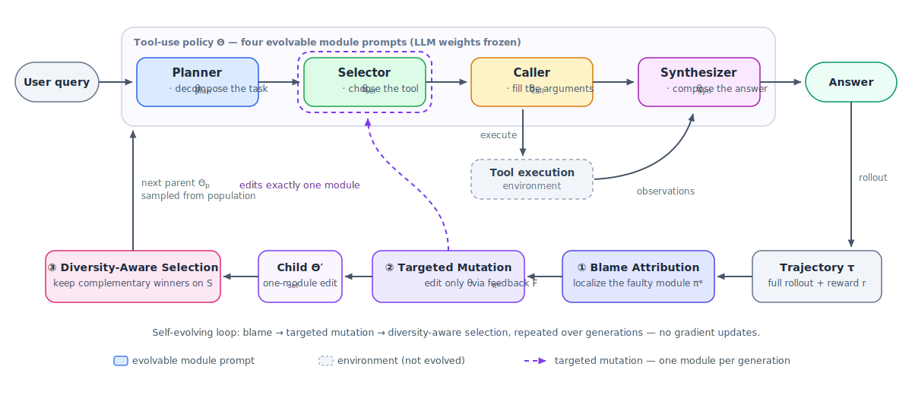

# EvoTool: Self-Evolving Tool-Use Policy Optimization in LLM Agents via Blame-Aware Mutation and Diversity-Aware Selection

Official implementation of the paper by *Shuo Yang, Soyeon Caren Han, Xueqi Ma, Yan Li, Mohammad Reza Ghasemi Madani, Eduard Hovy* (The University of Melbourne) — [arXiv:2603.04900](https://arxiv.org/abs/2603.04900).

[](https://arxiv.org/abs/2603.04900)
[](https://syang2000.github.io/ACL_2026_EvoTool/)
[](LICENSE)

[**Paper**](https://arxiv.org/abs/2603.04900) | [**Project Page**](https://syang2000.github.io/ACL_2026_EvoTool/) | [**Interactive Replay**](https://syang2000.github.io/ACL_2026_EvoTool/replay.html) | [**Case Study**](CASE_STUDY.md) | [**Data Guide**](DATA.md)

EvoTool is a self-evolving framework that optimizes a modular tool-use policy with a gradient-free evolutionary loop. The policy is decomposed into four modules — **Planner** (task decomposition), **Selector** (tool choice), **Caller** (argument construction), and **Synthesizer** (final answer) — each defined by an evolvable natural-language prompt specification. Three mechanisms drive the loop: **Trajectory-Grounded Blame Attribution** reads diagnostic traces to localize each failure to the responsible module; **Feedback-Guided Targeted Mutation** edits only that module via natural-language critique; and **Diversity-Aware Population Selection** preserves complementary candidates rather than a single greedy winner. Across four tool-use benchmarks, EvoTool outperforms strong baselines by over 5 points on both GPT-4.1 and Qwen3-8B.

<p align="center">
  
</p>

## News

- **2026-07** — Code released, with curated demo subsets, evolved-policy artifacts (`evolved_policies/`), an offline [generation-by-generation replay](docs/replay.html), and a [case study](CASE_STUDY.md).

## Installation

Requires Python >= 3.11. The runner itself only needs an OpenAI-compatible client and YAML:

```bash
git clone https://github.com/SYang2000/ACL_2026_EvoTool.git
cd ACL_2026_EvoTool
pip install -r requirements.txt
```

**Model serving.** All LLM calls go through one OpenAI-compatible endpoint (`llm.base_url`, default `http://127.0.0.1:8000/v1`). Any server works; for the paper backbone we serve Qwen3-8B locally with [vLLM](https://github.com/vllm-project/vllm) (install `vllm` yourself — it is intentionally not in `requirements.txt`):

```bash
MODEL=Qwen/Qwen3-8B bash scripts/launch_vllm.sh
```

`MODEL` (a local path or HF id) is required. Optional environment variables: `SERVED_NAME` (served model name, defaults to the basename of `MODEL`, e.g. `Qwen3-8B` — it must match `llm.model_name` in the config), `PORT` (default 8000), `VENV_PY` (python with vLLM installed, default `python`), `CUDA_VISIBLE_DEVICES` (default 0), and `HF_HOME` (passed through if set). The script starts `vllm.entrypoints.openai.api_server` with `--max-model-len 8192 --gpu-memory-utilization 0.85 --enforce-eager --trust-remote-code`; a single A100 is plenty for an 8B model.

## Quick Start / Demo

**What ships in `data/`.** The repo bundles curated demo subsets so the full evolution loop runs out of the box:

| Dataset | Instances | Split (seed 42) | Purpose |
|---|---|---|---|
| `data/bfcl` | 150 | 90 train / 30 selection / 30 held-out test | demo subset of BFCL |
| `data/restbench` | 150 | 90 / 30 / 30 | demo subset of RestBench (TMDB + Spotify) |
| `data/toolbench` | 150 (+ recorded API responses) | 90 / 30 / 30 | demo subset of ToolBench |
| `data/dummy` | 6 | toy | smoke tests |
| `data/diverse` | 9 | toy | smoke tests (selection-diversity sanity) |

`data/taubench` is **not** bundled — build it from the official tau-bench repo in one command (see [DATA.md](DATA.md)). Tool calls never hit live APIs: a deterministic offline executor replays recorded responses (ToolBench), runs a real vendored retail DB (tau-bench), mocks typed REST responses from the OAS shape (RestBench), or does AST matching with no execution (BFCL, the official paradigm).

> [!IMPORTANT]
> The bundled datasets are **small curated demo subsets** meant to verify the evolution loop end-to-end. They are **not** the official evaluation sets, and results on them **will not match the paper's numbers**. The paper's experiments use Qwen3-8B (and GPT-4.1) on the full official benchmarks — see [DATA.md](DATA.md) for how to build those from source.

**1. Smoke run (~35 s).** With a server running (here: served name `Qwen3-4B`; substitute yours):

```bash
python run.py --config configs/evotool.yaml --benchmark dummy \
  --override llm.base_url=http://127.0.0.1:8000/v1 llm.model_name=Qwen3-4B evolve.epochs=1
```

Verified expected output (final result line; exact numbers vary with the served model):

```
--> success=100.0 mean_reward=98.64 tokens=23298 time=34.4s
```

**2. Demo run on BFCL.** Add `--override evolve.epochs=1` for a faster first pass (30 generations instead of 90); a full 3-epoch run on one benchmark takes a few hours on a single A100-class GPU:

```bash
python run.py --config configs/evotool.yaml --benchmark bfcl --override evolve.epochs=1
```

Each run writes a result JSON to `results/<benchmark>__<preset>.json`, a human-readable log, and a structured per-generation run log (`results/logs/<benchmark>__<preset>.runlog.jsonl`) with blame diagnoses, prompt diffs, and learning-curve arrays — the same format that powers the [interactive replay](docs/replay.html).

## Baselines & ablations = config presets

Every paper baseline/ablation is a config preset layered on top of `configs/base.yaml`. One command pattern covers all of them:

```bash
python run.py --config configs/<preset>.yaml --benchmark {bfcl,restbench,toolbench,taubench}
```

| Preset | `mutation_target` | `selection` | Notes |
|---|---|---|---|
| `configs/evotool.yaml` | `blame` | `diversity` | **EvoTool (full method)** |
| `configs/baselines/static.yaml` | `none` | `static` | no evolution (Table 2 "Static") |
| `configs/baselines/random.yaml` | `random` | `diversity` | random module target (Table 2 "Random") |
| `configs/baselines/single_plan.yaml` | `fixed:planner` | `diversity` | single-aspect: planner only |
| `configs/baselines/single_sel.yaml` | `fixed:selector` | `diversity` | single-aspect: selector only (1 epoch) |
| `configs/baselines/single_call.yaml` | `fixed:caller` | `diversity` | single-aspect: caller only (1 epoch) |
| `configs/baselines/single_syn.yaml` | `fixed:synthesizer` | `diversity` | single-aspect: synthesizer only (1 epoch) |
| `configs/baselines/monolithic.yaml` | `all` | `greedy` | monolithic: mutate all modules as one prompt (1 epoch) |
| `configs/ablations/evotool_wo_tau.yaml` | `blame` | `diversity` | `use_trajectory=false` (mutator gets no trajectory evidence τ) |
| `configs/ablations/evotool_wo_F.yaml` | `blame` | `diversity` | `use_feedback=false` (no natural-language critique F) |
| `configs/ablations/evotool_wo_both.yaml` | `blame` | `diversity` | `use_trajectory=false, use_feedback=false` (unguided mutation) |
| `configs/ablations/sel_greedy.yaml` | `blame` | `greedy` | selection ablation (Table 4 "Greedy") |
| `configs/ablations/sel_topk.yaml` | `blame` | `topk` (k=2) | selection ablation (Table 4 "Top-k") |

Presets marked "(1 epoch)" set `evolve.epochs: 1` (a reduced budget) in the yaml; all others use the default 3 epochs from `configs/base.yaml`. Any field can be overridden from the CLI, e.g. `--override evolve.epochs=3 llm.model_name=Qwen3-8B`.

## Results (from the paper)

Condensed from Table 1 of the paper (per-benchmark averages and overall). Metrics: ToolBench = Pass Rate (avg of G1/G2/G3), RestBench = Success Rate (avg of TMDB/Spotify), τ-Bench = Pass@1 (avg of Retail/Airline), BFCL = Accuracy (avg of Single/Multi-turn). Per-split numbers (G1/G2/G3, TMDB/Spotify, Retail/Airline, Single/Multi-turn) are in the paper; the [project page](https://syang2000.github.io/ACL_2026_EvoTool/) additionally shows the ablation tables.

**GPT-4.1 backbone**

| Method | ToolBench | RestBench | τ-Bench | BFCL | Overall |
|---|---|---|---|---|---|
| ReAct | 63.6 | 73.4 | 47.9 | 56.0 | 60.6 |
| CoT | 50.9 | 61.7 | 29.8 | 32.3 | 44.5 |
| Plan-and-Solve | 59.3 | 67.0 | 47.6 | 41.3 | 54.4 |
| OPRO | 65.2 | 75.1 | 47.5 | 58.9 | 62.1 |
| PromptBreeder | 63.2 | 74.7 | 43.9 | 58.8 | 60.5 |
| EvoPrompt | 66.4 | 76.9 | 48.6 | 62.1 | 63.8 |
| AdaPlanner | 56.5 | 68.2 | 50.5 | 55.2 | 57.5 |
| EasyTool | 73.9 | 82.5 | 40.6 | 56.1 | 64.4 |
| DRAFT | 75.8 | 84.8 | 38.8 | 54.9 | 64.9 |
| AnyTool | 67.7 | 76.8 | 48.3 | 58.2 | 63.3 |
| **EvoTool** | **77.7** | **86.2** | **52.0** | **63.1** | **70.6** |

**Qwen3-8B backbone**

| Method | ToolBench | RestBench | τ-Bench | BFCL | Overall |
|---|---|---|---|---|---|
| ReAct | 54.2 | 63.5 | 23.8 | 52.0 | 49.0 |
| CoT | 43.3 | 53.3 | 11.4 | 31.1 | 35.7 |
| Plan-and-Solve | 50.4 | 57.9 | 23.5 | 39.8 | 43.7 |
| OPRO | 55.5 | 64.9 | 23.5 | 54.4 | 50.2 |
| PromptBreeder | 53.9 | 64.6 | 21.0 | 54.2 | 49.0 |
| EvoPrompt | 56.5 | 66.5 | 24.3 | 55.8 | 51.4 |
| AdaPlanner | 48.1 | 59.0 | 25.6 | 51.6 | 46.3 |
| EasyTool | 62.3 | 69.8 | 15.6 | 51.0 | 51.1 |
| DRAFT | 64.5 | 73.3 | 13.4 | 49.8 | 51.8 |
| AnyTool | 57.7 | 66.4 | 19.1 | 51.1 | 49.6 |
| **EvoTool** | **66.2** | **74.6** | **25.8** | **56.7** | **57.0** |

Overall, EvoTool improves over the strongest baseline by **+5.7** (70.6 vs DRAFT's 64.9, GPT-4.1) and **+5.2** (57.0 vs DRAFT's 51.8, Qwen3-8B).

## Reference artifacts

For a prompt-evolution method, the evolved prompt specifications **are** the trained artifact — the analogue of a model checkpoint. `evolved_policies/<benchmark>/theta_star.json` ships the deployed best policy Θ\* per benchmark: the four evolved module specs plus policy id and provenance. *Provenance note:* these come from a reference testbed run (Qwen3-4B backbone, 150-instance demo subsets, 90/30/30 split, seed 42, 3 epochs), not from the paper's Qwen3-8B evaluation; rerunning `run.py` regenerates comparable artifacts.

To see the mechanism at work on real run logs:

- [CASE_STUDY.md](CASE_STUDY.md) — how the loop evolved the deployed BFCL planner over 90 generations (blame diagnoses, prompt diffs, reward movements).
- [docs/replay.html](docs/replay.html) — offline interactive replay of all 90 generations ([live version](https://syang2000.github.io/ACL_2026_EvoTool/replay.html) on the project page).

## Repository layout

```
run.py                  # single entry point (--config, --benchmark, --override, --out)
configs/                # base.yaml + evotool.yaml + baselines/ + ablations/ presets
data/                   # curated demo subsets (see DATA.md)
scripts/
  launch_vllm.sh        # OpenAI-compatible vLLM server for the backbone
  data/build_*.py       # rebuild each dataset from its official source
  verify_data.py        # data quality gate (gold plan must pass the official metric)
  run_matrix.py, ...    # sweep helpers, analysis, evolution traces
src/
  policy/               # the 4-module policy (planner/selector/caller/synthesizer)
  evolve/               # blame attribution, targeted mutation, diversity selection
  env/ envs/            # offline executors + vendored tau-bench retail env
  evaluators.py         # official per-benchmark success metrics
evolved_policies/       # evolved Θ* prompt specs per benchmark (reference artifacts)
SPEC.md                 # implementation specification (rollout, reward, logging contracts)
docs/                   # project page, replay.html, static assets
```

## Data

See [DATA.md](DATA.md) for the unified instance schema, what is bundled vs. built locally, and how to rebuild every dataset from the official sources.

## Citation

```bibtex
@misc{yang2026evotool,
  title   = {EvoTool: Self-Evolving Tool-Use Policy Optimization in LLM Agents via Blame-Aware Mutation and Diversity-Aware Selection},
  author  = {Shuo Yang and Soyeon Caren Han and Xueqi Ma and Yan Li and Mohammad Reza {Ghasemi Madani} and Eduard Hovy},
  year    = {2026},
  eprint  = {2603.04900},
  archivePrefix = {arXiv},
  primaryClass  = {cs.AI},
  url     = {https://arxiv.org/abs/2603.04900}
}
```

## Acknowledgements

This project builds on [vLLM](https://github.com/vllm-project/vllm) for serving and the [Qwen](https://huggingface.co/Qwen/Qwen3-8B) model family as the open-weight backbone, and evaluates on four upstream benchmarks: [ToolBench](https://github.com/OpenBMB/ToolBench), [RestBench (RestGPT)](https://github.com/Yifan-Song793/RestGPT), [tau-bench](https://github.com/sierra-research/tau-bench), and [BFCL (gorilla)](https://github.com/ShishirPatil/gorilla). We thank the authors of these projects.

## License

Released under the [MIT License](LICENSE).
